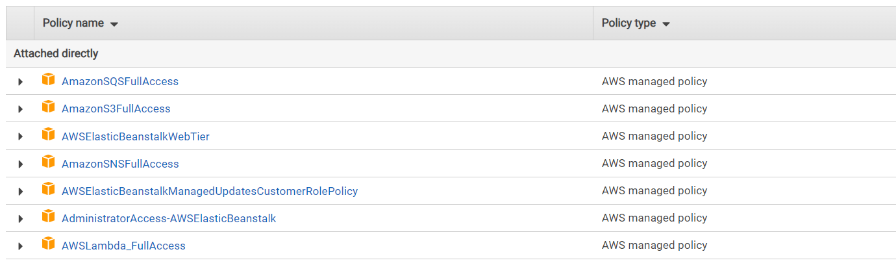

# cloud-server:
- Create user :

    `security credentials `>> `users` >> `add user`

    follow the steps and add the permisstions below :

    

    then that will generate `new_user_credentials` so save this file to use it later in CLI deployment
    
## GUI deploy :

1. Choose Elastic Beanstalk to deploy sever code to it
2. Create an enviroment 
3. Choose an application name
4. Choose the framework as you used (Node.js in our server) 
5. Upload youre code as zipped file 

## CLI deploy :
1. enter to server directory.
2. In Terminal hit `eb init`
3. choose server location , app name , framework (Node.js in our server) and version
4. To creat enviroment hit `eb create ENVIROMENT_NAME` 

# Links :

## [GUI deploy](http://cloudsever-env.eba-e3ezd29p.us-east-1.elasticbeanstalk.com/)

## [CLI deploy](http://cloud-sequad.eba-sxrjntxm.us-west-1.elasticbeanstalk.com/)
